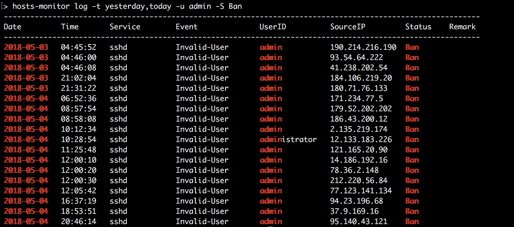
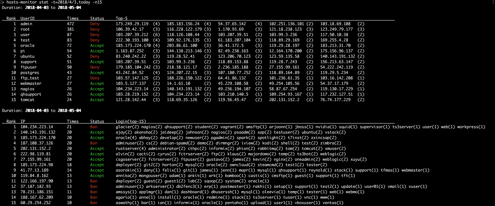

# Hosts-Monitor

#### Version 2.1.2


The light service to manage suspicious hosts.  This repository contains:

* **[hosts-monitor-service](./service)** : 
    the main service to ban the suspect per hour. 

* **[hosts-monitor](./bin)** : 
    user command to do the following actions:

    1. `log`:       list logs in hosts-monitor.report
    2. `show`:      show ips' status
    3. `ban`:       ban/unban specific ips manually (root only)
    4. `service`:   stop/start/restart `hosts-monitor-service` service (root only)
    5. `rule`:      set allow/deny rules to hosts-monitor-service
    6. `stat`:      statistics of ip (1) login times (2) login username (3) current status in report

* **config** :
    the configure file including the report path, and allow/deny rules; split into 3 parts:

    ```sh
    [env]
    # some environment variables to define
    # default:
    #   REPORT_LOC=/opt/hosts-monitor
    #   REPORT_NEW=/etc/ssh/sshd_banner
    #   DEBUG_MODE=0
    #   PASSWD_RETRY=2

    [allow]
    # login pattern always be ignored to ban

    [deny]
    # login pattern for connection denied

    ```

    Edit this file if you need.

* **INSTALL** :
    * Default installation directory: `INSTALL_DIR=/opt/hosts-monitor`
    * Default service path: `SERVICE=/etc/cron.hourly/hosts-monitor-service`


## Setup

```sh
$ sudo ./INSTALL
```

or change the installation path:
```sh
$ INSTALL_DIR=/opt/HM SERVICE=/etc/cron.daily ./INSTALL
```

## Uninstallation

```sh
$ cd $INSTALL_DIR
$ ./uninstall

Backup reports ? [Y/n] n
rm: remove 1 argument recursively? y
Uninstall completely.
```


## Usage Examples

   1. list/search log

```sh
$ hosts-monitor log                     # show today's log
$ hosts-monitor log \(root\|admin\)     # show log which contains `root` or `admin`
$ hosts-monitor log --status ban        # show the ban list
$ hosts-monitor log --help
```

   2. show ip status

```sh
$ hosts-monitor show 114.89.62.1        # show 114.89.62.1 status
$ hosts-monitor show --help
```

   3. ban/unban ip [root only]

```sh
$ sudo hosts-monitor ban 1.1.1.1            # add 1.1.1.1 into /etc/hosts.deny
$ sudo hosts-monitor ban 1.1.1.1 2.2.2.2    # allow multiple ips
$ sudo hosts-monitor ban -m 'BruteForce' 1.1.1.1 2.2.2.2   # add description(no space) about ips
$ sudo hosts-monitor unban 2.2.2.2          # remove 2.2.2.2 from /etc/hosts.deny
$ hosts-monitor ban --help
```

   4. control `hosts-monitor-service` [root only]

```sh
$ sudo hosts-monitor-service stop       # disable hosts-monitor-service
$ sudo hosts-monitor-service restart    # enable hosts-monitor-service and run it
$ hosts-monitor-service --help
```

   5. add allow/deny rules for `hosts-monitor-service` [root only]

```sh
$ sudo hosts-monitor rule --set-deny test user   # login with `test` or `user` will be rejected
$ sudo hosts-monitor rule --remove root          # cancel this rule
$ sudo hosts-monitor rule --show                 # show all rules
$ hosts-monitor rule --help
```

Type `hosts-monitor help` for more description.

## DEMO

### log



### show


### rule


### stat



## Bugs Report

Welcome to raise the issue if you found bugs or have any problem when using this tools. :smile:

---

## VERSION ISSUES
#### r2.1.2
##### Bug fixing
- [x] (profile) textcolor only works when $TERM=xterm
- [x] (hosts-monitor-service) remove `$refused_ip` to avoid the too long argument in `awk`

#### r2.1.0
##### New features
- [x] `stat` : summary the ip (1) login times (2) login username (3) current status in report
- [x] (show) `--oneline`: show ip status in one-line
- [ ] ~~(show) `--status`: show ban list (like `$ fail2ban-client status sshd` + tree)~~
- [x] (log) `--tmp`: print short-report
- [x] (log) `--time <time1>,<time2>`: search time range <time1> to <time2>
- [x] (ban) check `fail2ban` and unban
- [x] (ban `-m`) enable to comment a **sentence**
- [x] (rule `--check`) check the pattern status with current rules
- [x] (service) using `journalctl` to catch log
- [x] (service) add argument: BruteForce-Trying times
- [x] (INSTALL,uninstall,profile,config) change report path, change install-directory path, add DEBUG mode

##### Bug fixing
- [x] (ban) ban comment prompt ; unban bugs
- [x] (hosts.deny) the comment prompt \`#' caused **error: /etc/hosts.deny, line 1577: bad option name: ....** warning message because of the symbol \`:' in the comment message
- [x] (service) ban ips excluding \`refused connect from ...' in /var/log/auth.log
- [x] (log) fix `-S` problem
- [x] (show) comments in similiar case disappear

#### r2.0.0
- [x] Merge hosts-monitor & hosts-monitor-service (saved in `/opt/hosts-monitor`)
- [x] Ban-Rule add: username
- [x] Always-Allow: ip @ /etc/hosts.allow
- [x] show the /etc/hosts.deny status
